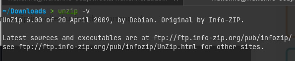
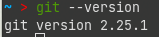
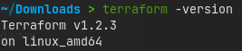
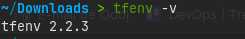
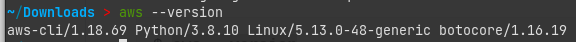
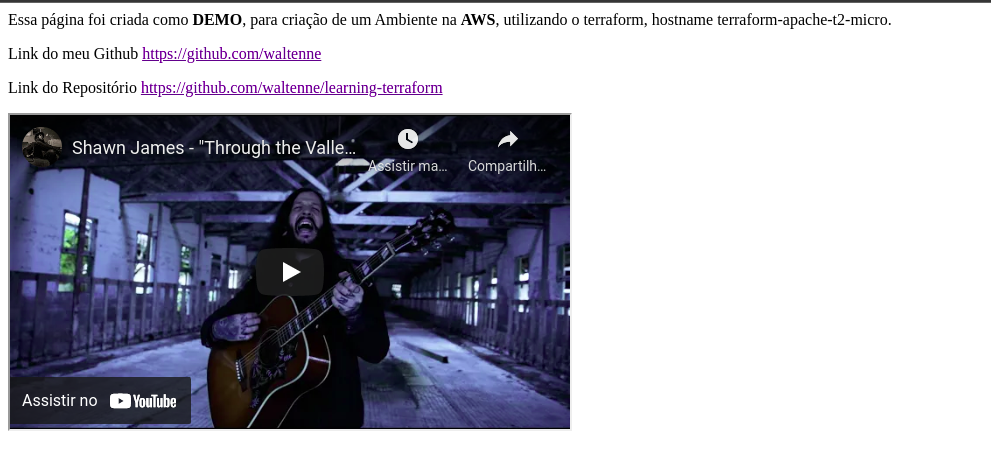

## :books: ÍNDICE

[:blue_book: Motivação](#motivacao)
[:blue_book: Preparação](#preparacao)
[:book: Instalando o Unzip](#instalando-o-unzip)
[:book: Instalando o Git](#instalando-o-git)
[:book: Instalando o VsCode](#instalando-o-vscode)
[:book: Instalando o Terraform](#instalando-o-terraform)
[:book: Instalando o tfenv](#instalando-o-tfenv)

# Motivacao

A motivação desse repositório é para aprendizado de IaC, especificamente utilizando o terraform da Hashicorp.

# Preparação

No meu ambiente utilizo o Linux :penguin: **ZorinOS**, algumas configurações durante o processo será utilziada utilizando o **dotfiles**

[:link: O que é DotFiles? - Mario Souto - Dev Soutinho](https://www.youtube.com/watch?v=Ficm64eRuVE)

Será utilizado as seguintes os pacotes

- **unzip**      - Descompactador de Arquivos
- **Git**        - Sistema de Controle de versão
- **Vscode**     - Editor de Código Fonte
- **Terraform**  - Geranciador de IaC
- **tfenv**      - Gerenciador de versão do Terraform
- **aws cli**    - Interface de linha de comando da AWS

## Instalando Unzip

Digite o seguinte comando no terminal

<pre>yes | apt-get install unzip</pre>

Você terá o seguinte retorno (o código da versão mudará de acordo com a data de instalação, caso tenha saido alguma versão nova.)

## Instalando o Git

[:link: Documentação Oficial](https://git-scm.com/download/linux)

ZorinOS utiliza base Ubuntu, com o sistema Atualizado, digite o seguinte comando no terminal

<pre>yes | apt-get install git</pre>

Após a intalação ser concluida para validar a instalação e versão digite o seguinte comando no terminal.

<pre>git --version</pre>

Você terá o seguinte retorno (o código da versão mudará de acordo com a data de instalação, caso tenha saido alguma versão nova.)

## Instalando VsCode

[:link: Documentação Oficial](https://code.visualstudio.com/docs/setup/linux)
[:link: Git Hub](https://github.com/Microsoft/vscode/issues/15529)

Estou realizando a instalação utilizando o pacote **.deb**

<pre>curl -o code.deb -L http://go.microsoft.com/fwlink/?LinkID=760868 ~/Downloads</pre>

Agora utilize o gerenciador de pacote **dpkg** para realizar a instalação

<pre>sudo dpkg -i ~/Downloads/code.deb</pre>

Após a instalação remova o **.deb** baixado.

<pre>rm ~/Downloads/code.deb</pre>

Pronto o VsCode está Instalado.

## Instalando o Terraform

[:link: Documentação Oficial](https://learn.hashicorp.com/tutorials/terraform/install-cli)

Realizando o Download da versão 1.2.3
<pre>
curl https://releases.hashicorp.com/terraform/1.2.3/terraform_1.2.3_linux_amd64.zip ~/Downloads
</pre>

Descompactando o arquivo **Zip**

<pre>unzip terraform_1.2.3_linux_amd64.zip</pre>

Preparando o binário no dotfiles

<pre>mv terraform ~/.doty/bin/apps</pre>

Criando o link simbolico

<pre>sudo ln -s ~/.doty/bin/apps/terraform /usr/local/bin/</pre>

Após a intalação ser concluida para validar a instalação e versão digite o seguinte comando no terminal.

<pre>terraform --version</pre>

Você terá o seguinte retorno (o código da versão mudará de acordo com a data de instalação, caso tenha saido alguma versão nova.)

## Instalando o tfenv

[:link: Documentação Oficial](https://github.com/tfutils/tfenv)

Clone o Repositorio

<pre>git clone https://github.com/tfutils/tfenv.git ~/.tfenv</pre>

Mova para o diretorio **dotfiles**

<pre>mv ~/Downloads/tfenv/ ~/.doty/bin/apps</pre>

Crie o link simbólico

<pre>sudo ln -s ~/.doty/bin/apps/tfenv/bin/* /usr/local/bin/</pre>

Para validar a versão

<pre>tfenv -version</pre>

Você terá o seguinte retorno (o código da versão mudará de acordo com a data de instalação, caso tenha saido alguma versão nova.)

# Instalando AWS CLI

[:link: Documentação Oficial](https://docs.aws.amazon.com/cli/latest/userguide/getting-started-install.html#cliv2-linux-install)

Digite os seguintes comandos

<pre>curl "https://awscli.amazonaws.com/awscli-exe-linux-x86_64.zip" -o "awscliv2.zip"
unzip awscliv2.zip
sudo ./aws/install
</pre>

Você terá o seguinte retorno (o código da versão mudará de acordo com a data de instalação, caso tenha saido alguma versão nova.)

<pre>aws --version</pre>

Instalação dos pacotes concluida, agora estamos prontos para começar :blue_heart:

Para utilizar entre no diretorio aws_ec2_apache e digite

<pre>terraform apply --auto-approve</pre>

Ao ser finalizado a inicialização o terraform irá devolver o IP e DNS da maquina para acesso

